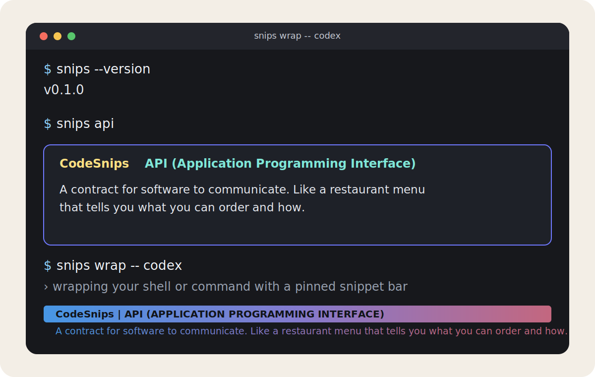

# codesnips

A lightweight terminal learning tool that docks coding snippets in your terminal while you work.

[](https://github.com/dev-boz/codesnips/actions/workflows/ci.yml)
[](https://github.com/dev-boz/codesnips/releases)



`codesnips` is a small Go CLI for two jobs:

- Show a quick concept card for a term.
- Wrap your shell or command with a pinned snippet bar at the bottom of the terminal.

The proxy mode rewrites cursor and scroll-region ANSI sequences so full-screen terminal apps like `vim`, `less`, and CLI agents keep rendering correctly inside the reduced viewport.

## Example snippets

- `MCP (Model Context Protocol)`
- `Docker`
- `REST`
- `Git`
- `Kubernetes (k8s)`

## Install

```bash
git clone https://github.com/dev-boz/codesnips.git
cd codesnips
go install ./cmd/snips
case "$SHELL" in
  *zsh) rc="$HOME/.zshrc" ;;
  *bash) rc="$HOME/.bashrc" ;;
  *) rc="$HOME/.profile" ;;
esac
bin_dir="$(go env GOBIN)"
[ -z "$bin_dir" ] && bin_dir="$(go env GOPATH)/bin"
printf 'export PATH="%s:$PATH"\n' "$bin_dir" >> "$rc"
. "$rc"
snips --version
```

Requires Go 1.21+.

## Usage

```bash
snips --version                 # Show build version
snips                           # Show a random snippet
snips docker                    # Show a specific term
snips --list                    # List all available terms
snips --search api              # Search snippets
snips wrap                      # Wrap your shell with the snippet bar proxy
snips wrap -- codex             # Run a specific command inside the proxy
snips wrap --height 3 --interval 45
```

Use a custom snippets file:

```bash
snips --file ./snippets.json
snips wrap --file ./snippets.json
```

If `--file` is omitted, the CLI loads `./snippets.json` when present, otherwise it falls back to built-in snippets bundled in the binary.

## Proxy mode

`snips wrap` runs your shell or command inside a PTY and keeps the snippets bar pinned at the bottom. The proxy rewrites absolute cursor and scroll-region VT sequences so full-screen terminal apps (for example `vim`, `less`, and CLI agents) continue to render correctly.

## Releases

- Tags follow SemVer: `vMAJOR.MINOR.PATCH`.
- Pushing a `v*` tag triggers the release workflow in GitHub Actions.
- Release artifacts include prebuilt binaries for Linux, macOS, and Windows, plus a checksum file.

## Development

```bash
go test ./...
go build ./cmd/snips
```

## Notes

- `snips --run` compatibility mode has been removed; use `snips wrap`.
- The project is Go-only and does not depend on Python, shell wrapper generation, or CGO.
